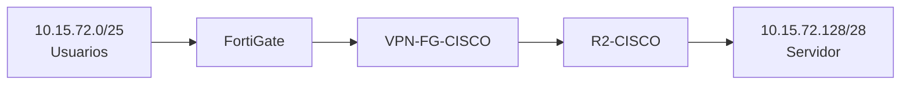

# Infraestructura 2 - VPN Site-to-Site FortiGate y Cisco

## Video demostrativo

https://youtu.be/n2tdpZlpy5Y?si=1uGPUrB9V_eTovj7

---

**Estudiante:** Oliver Eliam Aquino Paulino  
**Matrícula:** 20241571  
**Asignatura:** Seguridad de Redes  

## Descripción

Esta infraestructura conecta una red de usuarios con una red remota donde se encuentra un servidor web. La comunicación entre ambas redes se realiza mediante una **VPN Site-to-Site IPsec entre un FortiGate y un router Cisco**, utilizando a R1 como ISP simulado.

Además de la VPN, la práctica valida VLAN, DHCP, NAT, enrutamiento, HTTPS y el funcionamiento del túnel al activarlo y desactivarlo.

## Objetivo

- Comunicar la red de usuarios con el WEB-SRV mediante VPN Site-to-Site.
- Configurar el FortiGate completamente por GUI.
- Implementar NAT en FortiGate y R2.
- Verificar IKE e IPsec en el router Cisco.
- Probar HTTPS hacia el servidor.
- Demostrar que al desactivar la VPN la comunicación se pierde.

## Topología


### Flujo de la VPN



## Componentes principales

| Equipo | Función |
|---|---|
| USER-PC-1 | Cliente de la VLAN 10 |
| SW-USERS | Switch de acceso para usuarios |
| FortiGate | Gateway, DHCP, NAT, políticas y extremo VPN |
| R1 | ISP simulado entre FortiGate y R2 |
| R2-CISCO | NAT, gateway de servidor y extremo VPN Cisco |
| WEB-SRV-1 | Servidor Nginx con HTTPS/443 |

## Direccionamiento

| Elemento | Dirección / Red | Función |
|---|---|---|
| VLAN 10 - Usuarios | 10.15.72.0/25 | Red de usuarios |
| FortiGate VLAN10-USERS | 10.15.72.1/25 | Gateway de usuarios |
| DHCP | 10.15.72.2 - 10.15.72.126 | Pool de clientes |
| FortiGate port1 | 192.168.200.2/24 | Administración |
| FortiGate WAN | 203.0.113.161/30 | Enlace hacia R1 |
| R1 hacia FortiGate | 203.0.113.162/30 | ISP |
| R1 hacia R2 | 198.51.100.161/30 | ISP |
| R2 WAN | 198.51.100.162/30 | Peer Cisco |
| R1 Loopback0 | 192.0.2.158/32 | Pruebas de NAT |
| Red servidor | 10.15.72.128/28 | LAN remota |
| R2 LAN | 10.15.72.129/28 | Gateway de servidor |
| WEB-SRV-1 | 10.15.72.130/28 | Servidor HTTPS |

## VLAN 10 y DHCP

En el FortiGate se creó:

- Nombre: `VLAN10-USERS`
- Interfaz padre: `port2`
- VLAN ID: `10`
- Dirección: `10.15.72.1/25`

El DHCP entrega:

- Rango: `10.15.72.2 - 10.15.72.126`
- Gateway: `10.15.72.1`
- DNS: `8.8.8.8`

Durante las pruebas, USER-PC-1 recibió la dirección `10.15.72.2/25`.

## WAN y rutas

### FortiGate

- WAN: `203.0.113.161/30`
- Gateway por defecto: `203.0.113.162`
- Red remota: `10.15.72.128/28`
- Interfaz hacia la red remota: `VPN-FG-CISCO`

### R2-CISCO

- WAN: `198.51.100.162/30`
- Gateway por defecto: `198.51.100.161`
- LAN del servidor: `10.15.72.129/28`

## VPN Site-to-Site

### FortiGate

- Nombre: `VPN-FG-CISCO`
- Peer remoto: `198.51.100.162`
- IKE: versión 1
- Modo: Main
- Cifrado: DES
- Hash: SHA1
- Diffie-Hellman: grupo 14
- Lifetime Phase 1: 86400 segundos
- Red local: `10.15.72.0/25`
- Red remota: `10.15.72.128/28`
- PFS: deshabilitado
- Lifetime Phase 2: 3600 segundos

### R2-CISCO

La política IKE utiliza:

```text
encr des
hash sha
authentication pre-share
group 14
lifetime 86400
```

Transform-set:

```text
TS-VPN-DES
esp-des
esp-sha-hmac
```

Crypto map:

```text
VPN-MAP
Peer: 203.0.113.161
ACL: VPN-TRAFFIC
```

La PSK está redactada en los archivos públicos.

## Políticas del FortiGate

### USERS-to-WAN-NAT

Permite salida desde la VLAN de usuarios hacia la WAN y aplica NAT.

### USERS-to-VPN

Permite tráfico desde:

`10.15.72.0/25`

hacia:

`10.15.72.128/28`

por el túnel VPN, sin NAT.

### VPN-to-USERS

Permite el tráfico de retorno desde la red del servidor hacia la red de usuarios, también sin NAT.

## NAT en R2-CISCO

R2 utiliza:

- `FastEthernet1/0` como `ip nat inside`
- `FastEthernet0/0` como `ip nat outside`

El NAT se realiza mediante:

```text
ip nat inside source route-map NAT-RM interface FastEthernet0/0 overload
```

La ACL de NAT excluye el tráfico destinado a la red de usuarios para evitar traducir el tráfico que debe entrar en la VPN.

Durante la evidencia de prueba se registraron:

- NAT hits: `8`
- NAT misses: `0`

También se comprobó una traducción desde `10.15.72.130` hacia `198.51.100.162`.

## Servidor WEB

El WEB-SRV utiliza:

- IP: `10.15.72.130/28`
- Gateway: `10.15.72.129`
- Servicio: Nginx
- Protocolo: HTTPS
- Puerto: TCP/443

Para preparar el servidor se instalaron Nginx y OpenSSL y se configuró un certificado autofirmado para las pruebas HTTPS.

## Verificación de la VPN

En R2-CISCO se utilizaron:

```text
show crypto isakmp policy
show crypto isakmp sa
show crypto ipsec sa
```

### Resultado IKE

La asociación IKE quedó en:

```text
QM_IDLE
ACTIVE
```

Esto confirmó que la negociación IKE estaba establecida.

### Resultado IPsec

Los contadores IPsec mostraron tráfico cifrado en ambos sentidos, con paquetes encapsulados y desencapsulados aumentando durante las pruebas.

## Pruebas de conectividad

Desde USER-PC-1:

```bash
ip addr show eth0
ip route
ping 10.15.72.130
wget --no-check-certificate -O- https://10.15.72.130
traceroute 10.15.72.130
```

### Resultados

| Prueba | Resultado |
|---|---|
| DHCP | USER-PC obtuvo 10.15.72.2/25 |
| Ping hacia WEB-SRV | Correcto, sin pérdida |
| HTTPS/443 | Correcto |
| Traceroute | Llegó a 10.15.72.130 |
| IKE | QM_IDLE / ACTIVE |
| IPsec | Tráfico cifrado en ambos sentidos |
| NAT en R2 | Funcionando |
| VPN desactivada | 100% packet loss |
| VPN reactivada | Comunicación restablecida |

## Prueba principal: VPN ON / OFF

La prueba principal demuestra el objetivo de la práctica.

Con la VPN activa, USER-PC-1 puede alcanzar `10.15.72.130`.

Para demostrar la dependencia del túnel, se retiró temporalmente el crypto map de la interfaz WAN de R2. Después de hacerlo, el ping desde USER-PC hacia el servidor registró:

```text
100% packet loss
```

Al volver a aplicar el crypto map, la VPN se negoció nuevamente y la comunicación se restableció.

## Archivos del repositorio

### Documentación

- [Documentación PDF completa](Documentacion_Infraestructura2_VPN_Oliver_Aquino.pdf)

### Running-Configs

- [R1 / ISP](running-configs/R1-ISP_running-config.txt)
- [R2-CISCO](running-configs/R2-CISCO_running-config_SANITIZADO.txt)
- [SW-USERS](running-configs/SW-USERS_running-config.txt)
- [FortiGate - Backup completo sanitizado](running-configs/FortiGate_BACKUP_COMPLETO_SANITIZADO.conf)
- [USER-PC / DHCP](running-configs/USER-PC_DHCP_info.txt)
- [WEB-SRV](running-configs/WEB-SRV_config.txt)

### Scripts y pruebas

- [Configuración completa y pruebas](scripts/Configuracion_Completa_y_Pruebas_Infraestructura2.md)
- [Direccionamiento y topología](scripts/DIRECCIONAMIENTO_Y_TOPOLOGIA.md)
- [Instalación Nginx/OpenSSL](scripts/WEB-SRV_instalar_nginx_openssl.txt)
- [Configuración GUI FortiGate](scripts/FortiGate_GUI_configuracion.md)
- [Comandos de verificación y demostración](scripts/COMANDOS_VERIFICACION_Y_DEMO.txt)
- [Pruebas y resultados](scripts/PRUEBAS_Y_RESULTADOS.md)

## Conclusión

La infraestructura cumple el objetivo planteado. La red de usuarios y la red del servidor se comunican mediante una VPN Site-to-Site entre FortiGate y Cisco. También quedaron validados DHCP, NAT, HTTPS, IKE, IPsec y traceroute.

La prueba de desactivar la VPN confirmó que la comunicación hacia la red remota depende directamente del túnel IPsec.

> Las credenciales, PSK y demás valores sensibles están redactados en las configuraciones públicas.
